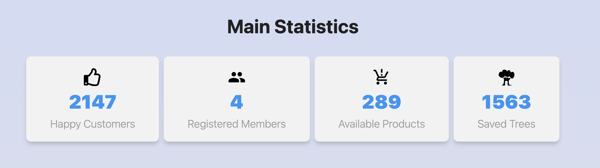

### Statistics section

Create a `<Statistics>` component that would display statistics from the
provided props - the main statistics of the online store regarding registered
users, reviews, etc. The data for the statistics is stored in a file
[data.json](./src/data/data.json).



The component should accept two props, `title` and `stats`, where title
specifies the title, and stats is an object containing the statistics.

- `title` - is optional, and if not passed, the `<h3>` heading markup should not
  be rendered.
- `stats` - an array of objects containing information about the statistics
  elements. It can have any number of elements.

The component should create the following structure.

```jsx
<StatisticTitle>Main Statistics</StatisticTitle>

<StatisticsList>
  <StatisticBox>
    {/* There should be an icon here */}
    <StatisticCounter>2147</StatisticCounter>
    <StatisticText>Happy Customers</StatisticText>
  </StatisticBox>

  <StatisticBox>
    {/* There should be an icon here */}
    <StatisticCounter>3275</StatisticCounter>
    <StatisticText>Registered Members</StatisticText>
  </StatisticBox>

  <StatisticBox>
    {/* There should be an icon here */}
    <StatisticCounter>289</StatisticCounter>
    <StatisticText>Available Products</StatisticText>
  </StatisticBox>

  <StatisticBox>
    {/* There should be an icon here */}
    <StatisticCounter>1563</StatisticCounter>
    <StatisticText>Saved Trees</StatisticText>
  </StatisticBox>
</StatisticsList>
```

> Tasks with an icon can be done at will. We need to think through the logic of
> how to dynamically draw from the
> [**react-icons**](https://github.com/react-icons/react-icons) library
> and >change the default size

#### Example of use

```js
import data from '/путь/к/data.json';

<Statistics title="Main Statistics" stats={data} />;
<Statistics stats={data} />;
```
