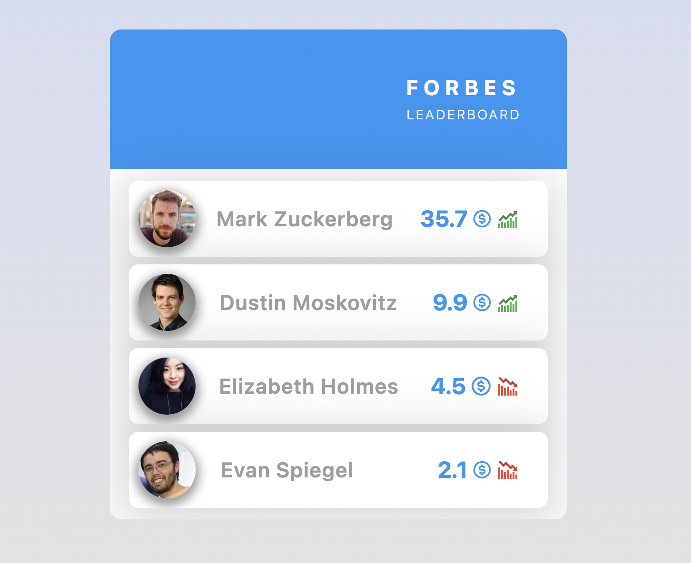

### Forbes List

It is necessary to create the <ForbesList> component, through which we could
display information about the current data from the **Forbes** portal.
Information about the current ranking is available in
[forbes.json](./src/data/forbes.json).



#### Опис компонента `<ForbesList>`

The component must accept one `list` prop - an array of friends' objects.

The component is responsible for destroying the structure.

```jsx
<LeaderBoard>
  <BoardHeader>
    <BoardTitle>
      <TitleTop>Forbes</TitleTop>
      <TitleBottom>Leader board</TitleBottom>
    </BoardTitle>
  </BoardHeader>

  <LeaderBoardProfiles>
    {/* Довільна кіл-сть FriendListItem */}
  </LeaderBoardProfiles>
</LeaderBoard>
```

#### Description of the `<ForbesListItem>` component

The component must accept several props:

- `avatar` - avatar of a millionaire
- `name` - the name of the millionaire
- `capital` - fortune of a millionaire
- `isIncrease` is a boolean indicating the state of the millionaire: increased
  or not.

Depending on the `isIncrease` prop, the icon should change: when increasing
fortune - `<FcBullish/>` or in case of decrease - `<FcBearish/>`

The component should have the following structure.

```jsx
<ForbesItem>
  <Avatar
    src="https://randomuser.me/api/portraits/men/32.jpg"
    alt="Mark Zuckerberg"
  />
  <Name>Mark Zuckerberg</Name>
  <Capital>
    35.7 <BiDollarCircle color={theme.colors.accent} size={22} />
    {/* Тут має бути необхідна іконка зміни статку */}
  </Capital>
</ForbesItem>
```

#### Example of use

```js
import forbes from 'data/forbes.json';

<FriendList list={forbes} />,
```
