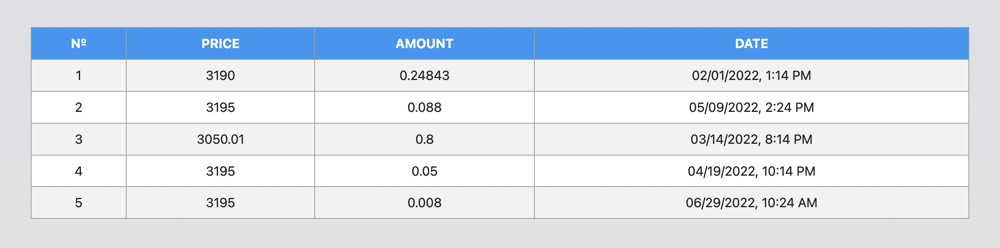

### Transaction history

It is necessary to create a transaction history component in the personal
account of the crypto-wallet.



The data for the list is available in JSON format in the file
[transactions.json](./src/data/transactions.json). This is an array of objects,
each object describes one transaction with the following properties:

- `id` is the unique identifier of the transaction
- `price` is the balance on the account
- `amount` - transaction amount
- `date` - transaction date

#### Description of the `<CryptoHistory>` component

It is necessary to create a component `<CryptoHistory>`, which accepts one prop
`items` - an array of transaction objects from `transactions.json`. The
component creates table markup. Each transaction is a table row. The example
shows the structure of two transactions.

```jsx
<BaseTable>
  <THead>
    <tr>
      <Th>№</Th>
      <Th>PRICE</Th>
      <Th>AMOUNT</Th>
      <Th>DATE</Th>
    </tr>
  </THead>

  <tbody>
    <Tr>
      <Td>1</Td>
      <Td>3190</Td>
      <Td>0.24843</Td>
      <Td>02/01/2022, 1:14 PM</Td>
    </Tr>
    <Tr>
      <Td>2</Td>
      <Td>3195</Td>
      <Td>0.088</Td>
      <Td>05/09/2022, 2:24 PM</Td>
    </Tr>
  </tbody>
</BaseTable>
```

> To format the date, use the [format](https://date-fns.org/v2.28.0/docs/format)
> method of the **date-fns** >library

#### Example of use

```js
import data from '/путь/к/data.json';

<Statistics title="Main Statistics" stats={data} />;
<Statistics stats={data} />;
```
